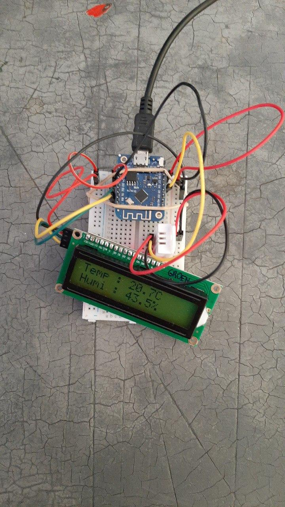

# Temperature and Humidity data collection, analyze and visualize   

This little project is about experimenting with esp8266 - dht22 - micropython - iot - mqtt - thingspeak

This repository contains the micropython code running on the Lolin D1 Mini. It collects data from the DHT22 sensor and writes it to the ThingSpeak platform.

The results can be seeen here : 
https://thingspeak.com/channels/753812/private_show

## MQTT:
is a machine-to-machine(M2M) / Internet of Things connectivity protocol.
https://en.wikipedia.org/wiki/MQTT

## Thingspeak:
is an IoT analytics platform service that allows you to aggregate, visualize, and analyze live data streams in the cloud. You can send data to ThingSpeak from your devices, create instant visualization of live data, and send alerts.
https://en.wikipedia.org/wiki/ThingSpeak

## ESP8266
is a low-cost Wi-Fi microchip, with a full TCP/IP stack and microcontroller capability
https://en.wikipedia.org/wiki/ESP8266

## DHT22:
is a basic, low-cost digital temperature and humidity sensor. 

## micropython:
is a software implementation of a programming language largely compatible with Python 3, written in C, that is optimized to run on a microcontroller.
https://en.wikipedia.org/wiki/MicroPython

## Setup:
- Lolin D1 Mini can be bought for ~ $3,50
- DHT22 ~ $2,50
- Breadboard ~ $3,00
- Jumper wires ~ $2,00
- Rubber band

